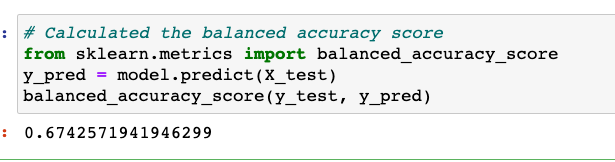
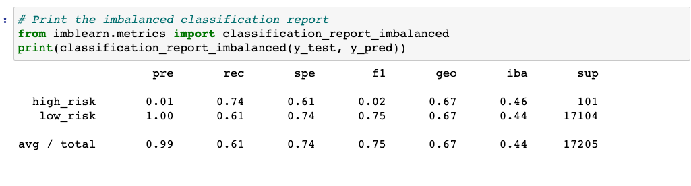
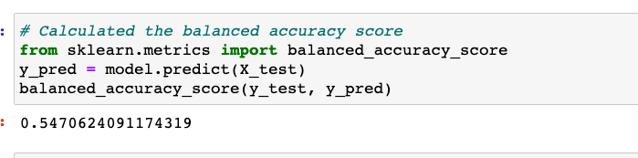
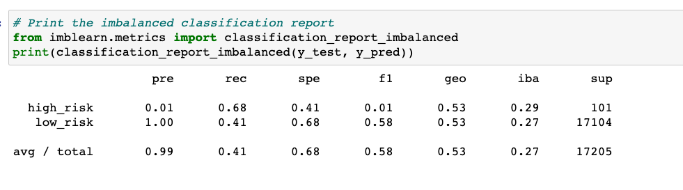
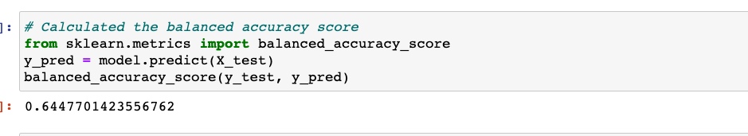
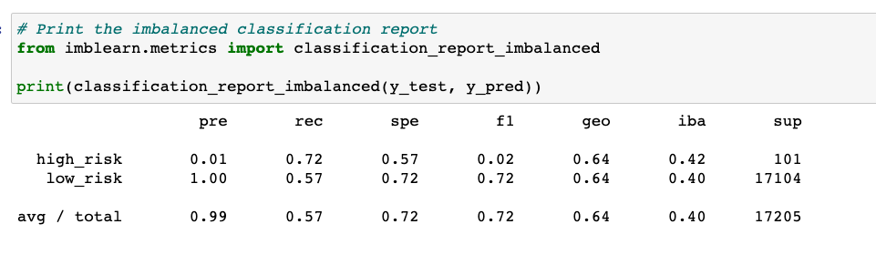
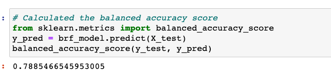
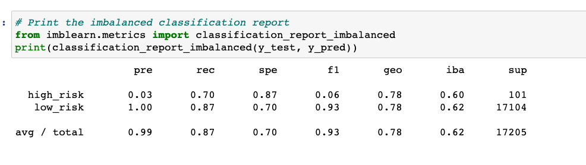
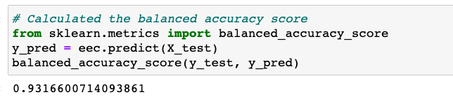
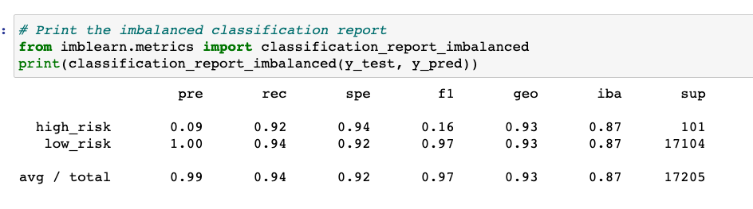

# Credit_Risk_Analysis

# Overview of the analysis

The main purpose of this analysis is to apply machine learning techniques to solve a credit card risk. We would use imbalanced-learn and scikit-learn libraries to build and evaluate models using resampling. First, we will oversample the provided dataset using the RandomOverSampler and SMOTE algorithms, and undersample the data using the ClusterCentroids algorithm. Then, we would use BalancedRandomForestClassifier and EasyEnsembleClassifier, to predict credit risk and provide a written analysis report.

# Results

* Naive Random Oversampling

As can be seen in,  accuracy score for naive random oversampling model is 0.674.

precision and recall for high risk and low risk loan-status for the same model are 0.01,1.00 and 0.74,0.61 respectively as shown below.

* SMOTE Oversampling

As can be seen in,  accuracy score for SMOTE oversampling model is 0.662.

where as precision,recall values for high risk and low risk loan-status for the same model are 0.01,1.00 and 0.63,0.69 respectively as shown below.

* Undersampling model

As can be seen in,  accuracy score for this model is 0.547

where as the precision,recall values for high risk and low risk loan-status for the same model are 0.01,1.00 and 0.68,0.41 respectively as shown below

* SMOTEEN

As can be seen in,  balanced accuracy score for this model is 0.644

precision,recall values for high risk and low risk loan-status for the same model are 0.01,1.00 and 0.72,0.57 respectively as shown below

* BalancedRandomForestClassifier Model

As can be seen in,  balanced accuracy score for this model is 0.788

precision,recall values for high risk and low risk loan-status for the same model are 0.03,1.00 and 0.70,0.87 respectively as shown below

* EasyEnsembleClassifier Model

As can be seen in,  balanced accuracy score for this model is 0.931

precision,recall values for high risk and low risk loan-status for the same model are 0.09,1.00 and 0.92,0.94 respectively as shown below

# Summary

As can be seen from the results, compared to all the machine learning models EasyEnsembleClassifier Model results in the highest balanced accury score of 0.931 and the second highest accuracy score of 0.788 is displayed by BalancedRandomForestClassifier Model.

However, from the confusion matrix results for all the machine learning models, the precision for the high risk loan applications is low, indicating a large number of false positives, which indicates an unreliable positive classification. F1 score is also low for all the models.

The recall is high for both high risk & low risk loan applications, which is indicative of a small number of false negatives. 

Due to the fact that the precision for high risk loans is very low and a large numer of loans could falsely identify as good ones, I would NOT recommend any of these models to predict credit risk.

